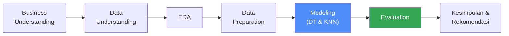
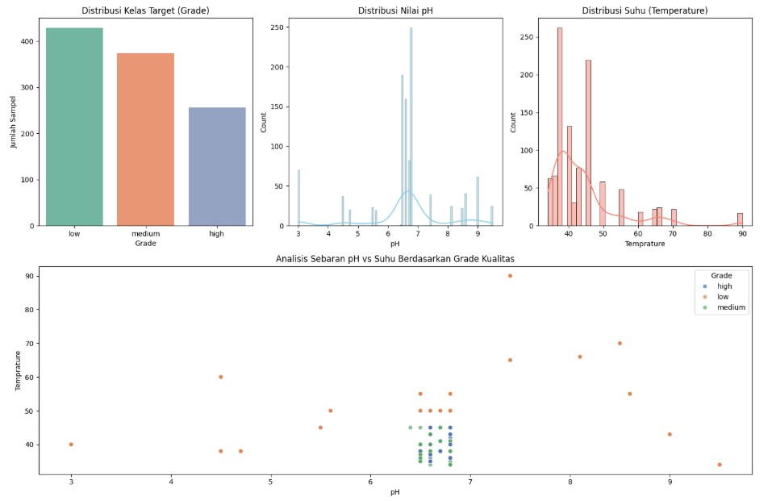
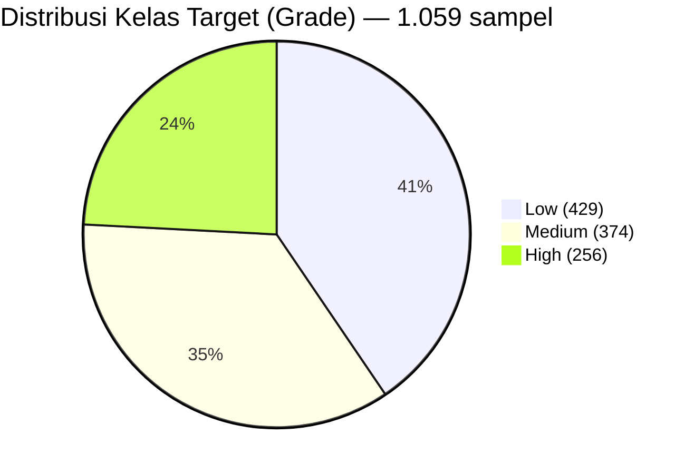
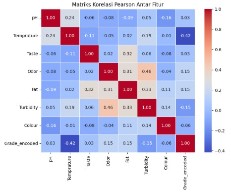
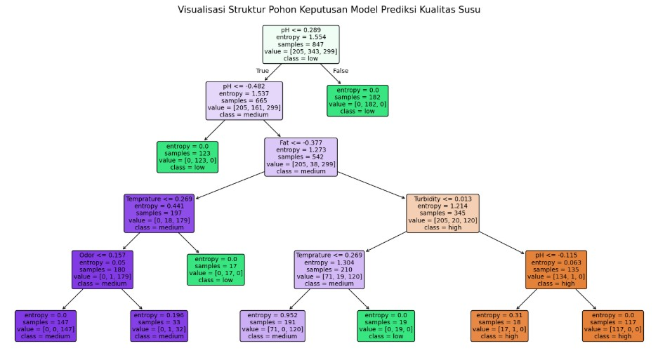
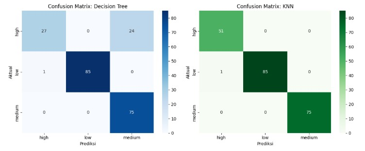

# Laporan UAS Kecerdasan Buatan
## Prediksi Kualitas Susu (Milk Quality Prediction) Menggunakan Algoritma *Decision Tree* dan *K-Nearest Neighbors*


-brightgreen)

| Item | Keterangan |
|---|---|
| **Mata Kuliah** | Kecerdasan Buatan |
| **Dosen Pengampu** | Leni Fitriani, S.T., M.Kom. |
| **Program Studi** | Teknik Informatika |
| **Jurusan** | Ilmu Komputer |
| **Universitas** | Institut Teknologi Garut |
| **Anggota Kelompok** | Sayyid Dzaky Farhan — NPM 2406007 |

---

## Daftar Isi
1. [Judul Proyek](#1-judul-proyek)
2. [Business Understanding](#2-business-understanding)
3. [Data Understanding](#3-data-understanding)
4. [Exploratory Data Analysis (EDA)](#4-exploratory-data-analysis-eda)
5. [Data Preparation](#5-data-preparation)
6. [Modeling](#6-modeling)
7. [Evaluation](#7-evaluation)
8. [Kesimpulan dan Rekomendasi](#8-kesimpulan-dan-rekomendasi)
9. [Referensi](#9-referensi)
10. [Lampiran](#10-lampiran-opsional)



---

## 1. Judul Proyek

> **Prediksi Kualitas Susu (Milk Quality Prediction) Menggunakan Algoritma Decision Tree dan K-Nearest Neighbors**

### Nama Kelompok
| No | Nama | NPM |
|---|---|---|
| 1 | Sayyid Dzaky Farhan | 2406007 |

### Domain Proyek (Latar Belakang)
Susu adalah salah satu sumber nutrisi utama bagi manusia, namun bersifat *perishable food* sangat mudah rusak akibat kontaminasi bakteri maupun kondisi penyimpanan yang tidak tepat. Kualitas susu mentah secara langsung memengaruhi kualitas dan rendemen (*yield*) produk olahan susu di tahap hilir, sehingga investasi pada pengendalian kualitas di hulu memberikan nilai ekonomi yang signifikan (Murphy et al., 2016). Proyek ini memanfaatkan pendekatan *Machine Learning* untuk mengotomatisasi proses klasifikasi kualitas susu berdasarkan parameter fisikokimia, sehingga proses inspeksi dapat dilakukan secara instan dan konsisten.

---

## 2. Business Understanding

### Permasalahan Dunia Nyata & Literature Review
Penentuan kualitas susu secara manual di pabrik pengolahan rentan terhadap inkonsistensi antar penguji dan sering memakan waktu karena membutuhkan pengujian laboratorium yang kompleks (Bhavsar et al., 2023). Berbagai penelitian terdahulu menunjukkan bahwa parameter fisikokimia seperti pH, suhu, rasa, bau, kandungan lemak, kekeruhan, dan warna merupakan indikator yang kuat untuk memprediksi kelas kualitas susu menggunakan algoritma klasifikasi seperti Decision Tree, KNN, Naïve Bayes, dan Random Forest (Çelik, 2022). Pendekatan berbasis sensor non-destruktif, misalnya *electronic nose* yang dipadukan dengan model pembelajaran mesin, juga telah dibuktikan mampu mengestimasi kualitas dan sumber susu secara cepat tanpa pengujian laboratorium konvensional (Mu et al., 2020).

### Tujuan Proyek
Mengimplementasikan dan **membandingkan kinerja dua algoritma *Machine Learning*** — **Decision Tree** dan **K-Nearest Neighbors (KNN)** untuk mengklasifikasikan kualitas susu ke dalam tiga tingkatan: `Low`, `Medium`, dan `High`, berdasarkan parameter fisikokimia.

### Siapa User/Pengguna Sistem
| Pengguna | Kebutuhan |
|---|---|
| **Staf Quality Control (QC)** | Menyortir pasokan susu dari peternak secara cepat di pabrik pengolahan |
| **Peternak Sapi Perah Mandiri** | Alat bantu digital portabel untuk memeriksa kualitas susu sebelum dikirim ke pengepul |

### Solusi dan Manfaat Implementasi AI
- **Solusi:** Sistem klasifikasi otomatis berbasis data fisikokimia yang memberikan hasil prediksi *real-time* pendekatan serupa pada sistem berbasis sensor portabel telah terbukti layak diimplementasikan pada perangkat keras sederhana (Helan Vidhya et al., 2023).
- **Manfaat:**
  - Mempercepat proses inspeksi kualitas dibanding uji laboratorium manual.
  - Meminimalkan kerugian akibat pencampuran susu berkualitas buruk dengan susu berkualitas baik.
  - Menjaga standardisasi & objektivitas penilaian produk akhir.

---

## 3. Data Understanding

### Sumber Data
Dataset **Milk Quality Prediction Dataset**, bersumber dari repositori publik (Kaggle), disimpan dalam format `.csv`. Dataset dengan struktur yang sama, 1.059 sampel dan 7 fitur fisikokimia untuk klasifikasi tiga kelas (*low*, *medium*, *high*), juga digunakan oleh Çelik (2022) untuk membandingkan algoritma ANN dan AdaBoost, sehingga dataset ini sudah cukup dikenal sebagai *benchmark* pada riset klasifikasi kualitas susu.

### Ukuran dan Format Data
| Properti | Nilai |
|---|---|
| Format file | `.csv` |
| Jumlah baris (sampel) | 1.059 |
| Jumlah kolom | 8 (7 fitur + 1 target) |
| Tipe masalah | Klasifikasi multi-kelas (3 kelas) |

### Deskripsi Setiap Fitur (Atribut)

| No | Fitur | Tipe Data | Deskripsi | Rentang / Nilai |
|---|---|---|---|---|
| 1 | `pH` | Numerik (float) | Tingkat keasaman susu | 3.0 – 9.5 |
| 2 | `Temprature` | Numerik (integer) | Suhu susu saat pengujian (°C) | 34 – 90 |
| 3 | `Taste` | Kategorik biner | Rasa: `1` = normal, `0` = tidak normal | {0, 1} |
| 4 | `Odor` | Kategorik biner | Bau: `1` = normal, `0` = tidak sedap | {0, 1} |
| 5 | `Fat` | Kategorik biner | Kadar lemak: `1` = sesuai standar, `0` = rendah | {0, 1} |
| 6 | `Turbidity` | Kategorik biner | Kekeruhan: `1` = tidak normal, `0` = normal | {0, 1} |
| 7 | `Colour` | Numerik (integer) | Intensitas warna susu | 240 – 255 |
| 8 | **`Grade`** (Target) | Kategorik **nominal** | Kelas kualitas susu | `low`, `medium`, `high` |

Keempat fitur pH, suhu, kekeruhan, dan warna ini juga menjadi parameter inti pada sistem prediksi kualitas susu berbasis perangkat keras sensor yang dikembangkan Helan Vidhya et al. (2023), yang mencapai akurasi 98.27% hanya dengan empat fitur tersebut.

**Tipe data dan target klasifikasi:** Target `Grade` bertipe kategorik nominal dengan **3 kelas** (*multi-class classification*), bukan biner, sehingga metrik evaluasi yang dipakai menggunakan rata-rata *macro*.

---

## 4. Exploratory Data Analysis (EDA)

### Visualisasi Distribusi Data





| Grade | Jumlah Sampel | Persentase |
|---|---|---|
| `low` | 429 | 40.51% |
| `medium` | 374 | 35.32% |
| `high` | 256 | 24.17% |

### Analisis Korelasi Antar Fitur



| Pasangan Fitur | Korelasi Pearson | Catatan |
|---|---|---|
| `Temprature` ↔ `Grade` | **-0.42** | Korelasi terkuat dengan target; suhu makin tinggi → grade cenderung makin rendah |
| `Odor` ↔ `Turbidity` | 0.46 | Susu berbau tidak normal cenderung juga keruh |
| `Fat` ↔ `Turbidity` | 0.33 | Kadar lemak berkorelasi sedang dengan kekeruhan |
| `Fat` ↔ `Taste` | 0.32 | Kadar lemak berkorelasi sedang dengan rasa |

### Deteksi Ketidakseimbangan Kelas (*Imbalanced Classes*)
Distribusi kelas target **`low` (429) > `medium` (374) > `high` (256)**. Selisih antar kelas tidak ekstrem (rasio kelas terbesar : terkecil ≈ 1.7 : 1), sehingga dikategorikan sebagai **ketidakseimbangan ringan-moderat** (*moderate imbalance*) dan masih aman digunakan tanpa teknik *resampling* khusus seperti SMOTE.

### Insight Awal dari Pola Data
1. **pH & Suhu sangat menentukan grade.** Susu berkualitas `high` mengelompok rapat pada rentang pH ≈ 6.5–6.8 dan suhu ideal 35–45 °C. Di luar rentang itu (pH < 5 atau > 8, suhu > 55 °C) susu cenderung langsung jatuh ke kategori `low`.
2. **Fitur biner saling berkorelasi.** `Odor`, `Fat`, dan `Turbidity` punya hubungan positif yang cukup kuat satu sama lain, mengindikasikan ketiganya sering "bergerak bersama" sebagai tanda kerusakan susu.
3. **Temuan penting — duplikasi data sangat tinggi.** Dari 1.059 baris, ternyata **976 baris (≈92%) adalah duplikat** kombinasi fitur yang identik. Temuan ini perlu dicatat sebagai catatan kritis (dibahas lebih lanjut di [bagian 8](#8-kesimpulan-dan-rekomendasi)).

---

## 5. Data Preparation

| Langkah | Hasil |
|---|---|
| **Cek nilai kosong (*null*)** | 0 nilai null di seluruh 8 kolom ✅ |
| **Cek duplikasi** | 976 dari 1.059 baris terdeteksi duplikat; **tetap dipertahankan** karena mencerminkan kombinasi nilai fisikokimia yang berulang secara wajar pada sensor biner |
| **Encoding target** | `LabelEncoder` → `high : 0`, `low : 1`, `medium : 2` |
| **Pemisahan fitur & target** | `X` = 7 kolom fitur, `y` = kolom `Grade` |
| **Split data** | `train_test_split(test_size=0.2, stratify=y, random_state=42)` → **847 baris train**, **212 baris test** |
| **Standardisasi** | `StandardScaler` diterapkan pada seluruh fitur numerik (`fit` di train, `transform` di test) untuk menyamakan skala sebelum masuk ke model berbasis jarak (KNN) |

```python
# Encoding label target
le = LabelEncoder()
y_encoded = le.fit_transform(y)        # high:0, low:1, medium:2

# Split 80% train - 20% test (stratified)
X_train, X_test, y_train, y_test = train_test_split(
    X, y_encoded, test_size=0.2, random_state=42, stratify=y_encoded
)

# Standardisasi fitur
scaler = StandardScaler()
X_train_scaled = scaler.fit_transform(X_train)
X_test_scaled  = scaler.transform(X_test)
```

---

## 6. Modeling

### Pemilihan Algoritma dan Alasan

| Algoritma | Alasan Pemilihan |
|---|---|
| **Decision Tree Classifier** | Non-parametrik, mampu menangani kombinasi fitur kontinu (`pH`, `Temprature`) dan biner (`Taste`, `Odor`, `Fat`, `Turbidity`) secara native. Pendekatan *induction* pohon keputusan ini pertama kali diformalkan secara sistematis oleh Quinlan (1986) melalui sistem ID3, dan tetap populer karena sifatnya yang *white-box* mudah diinterpretasikan lewat visualisasi pohon. |
| **K-Nearest Neighbors (KNN)** | Algoritma berbasis jarak/instans yang mengklasifikasikan sampel baru berdasarkan kemiripan dengan tetangga terdekat. Aturan keputusan tetangga terdekat ini pertama kali dirumuskan secara matematis oleh Cover dan Hart (1967), yang membuktikan bahwa galat klasifikasinya dibatasi paling tinggi dua kali galat klasifikasi Bayes optimal. |

### Implementasi Model

```python
from sklearn.tree import DecisionTreeClassifier
from sklearn.neighbors import KNeighborsClassifier

# 1. Decision Tree — max_depth dibatasi agar pohon tetap mudah dibaca & tidak overfitting
dt_model = DecisionTreeClassifier(max_depth=5, criterion='entropy', random_state=42)
dt_model.fit(X_train_scaled, y_train)

# 2. K-Nearest Neighbors — k=5 tetangga, jarak Euclidean
knn_model = KNeighborsClassifier(n_neighbors=5, metric='euclidean')
knn_model.fit(X_train_scaled, y_train)
```

### Visualisasi Model (Struktur Pohon Keputusan)



<details>
<summary>Cara membaca pohon di atas</summary>

Setiap kotak (*node*) menunjukkan fitur dan ambang batas (*threshold*) yang dipakai untuk membagi data, nilai *entropy* (tingkat ketidakmurnian kelas), jumlah sampel yang sampai ke node tersebut, dan kelas mayoritas pada node tersebut. Warna node merepresentasikan kelas dominan: makin pekat warnanya, makin "murni" node tersebut terhadap satu kelas.
</details>

---

## 7. Evaluation

### Confusion Matrix



**Decision Tree** (baris = aktual, kolom = prediksi)

| Aktual \ Prediksi | high | low | medium |
|---|---|---|---|
| **high** | 27 | 0 | 24 |
| **low** | 1 | 85 | 0 |
| **medium** | 0 | 0 | 75 |

**K-Nearest Neighbors (KNN)**

| Aktual \ Prediksi | high | low | medium |
|---|---|---|---|
| **high** | 51 | 0 | 0 |
| **low** | 1 | 85 | 0 |
| **medium** | 0 | 0 | 75 |

### Metrik Evaluasi (Perbandingan)
Evaluasi performa menggunakan empat metrik standar, *accuracy, precision, recall,* dan *F1-score* dengan rata-rata makro, karena akurasi tunggal dapat menyesatkan pada kasus multi-kelas yang sedikit tidak seimbang seperti pada proyek ini (Powers, 2011).

| Metrik Evaluasi | Decision Tree | KNN | Selisih |
|---|---|---|---|
| **Accuracy** | 88.21% | **99.53%** | +11.32% |
| **Precision (Macro)** | 90.73% | **99.36%** | +8.63% |
| **Recall (Macro)** | 83.93% | **99.61%** | +15.68% |
| **F1-Score (Macro)** | 84.66% | **99.48%** | +14.82% |

<details>
<summary>Lihat <i>classification report</i> per kelas (klik untuk membuka)</summary>

**Decision Tree**
| Kelas | Precision | Recall | F1-Score | Support |
|---|---|---|---|---|
| high | 0.96 | 0.53 | 0.68 | 51 |
| low | 1.00 | 0.99 | 0.99 | 86 |
| medium | 0.76 | 1.00 | 0.86 | 75 |

**K-Nearest Neighbors (KNN)**
| Kelas | Precision | Recall | F1-Score | Support |
|---|---|---|---|---|
| high | 0.98 | 1.00 | 0.99 | 51 |
| low | 1.00 | 0.99 | 0.99 | 86 |
| medium | 1.00 | 1.00 | 1.00 | 75 |
</details>

### Penjelasan Kinerja Model & Model Terbaik

> **Model terbaik: K-Nearest Neighbors (KNN)**, dengan akurasi **99.53%** vs Decision Tree **88.21%**.

Dari confusion matrix terlihat jelas sumber selisih performa: Decision Tree berhasil sempurna memisahkan kelas `low` dan `medium`, namun **24 dari 51 sampel `high` (≈47%) justru salah diprediksi sebagai `medium`**, terlihat dari *recall* kelas `high` yang hanya 0.53. Hal ini terjadi karena batas keputusan (*decision boundary*) antara `high` dan `medium` pada dataset ini tidak sejajar sumbu (*axis-aligned*), ia bergantung pada kombinasi pH **dan** suhu sekaligus, sementara Decision Tree dengan `max_depth=5` membagi data satu fitur per *split* sehingga kurang leluasa menangkap batas diagonal tersebut, sesuai karakteristik dasar algoritma *induction* pohon (Quinlan, 1986).

KNN, sebaliknya, mengukur jarak Euclidean ke semua fitur secara simultan dalam ruang yang sudah distandardisasi, sesuai prinsip aturan tetangga terdekat (Cover & Hart, 1967), sehingga mampu menangkap kemiripan multidimensi antar sampel `high` dengan lebih akurat. Hasilnya seluruh 51 sampel `high` terklasifikasi benar (*recall* = 1.00). Kedua model sama-sama keliru pada **1 sampel `low` yang diprediksi sebagai `high`**, mengindikasikan adanya satu sampel *borderline*/outlier pada batas pH-suhu yang sulit dibedakan oleh kedua model.

---

## 8. Kesimpulan dan Rekomendasi

### Ringkasan Hasil Modeling dan Evaluasi
Proyek ini berhasil membangun dan membandingkan dua model klasifikasi kualitas susu berbasis parameter fisikokimia. **KNN (k=5)** terbukti unggul signifikan dibanding **Decision Tree (max_depth=5)**, terutama dalam mengenali kelas `high` yang menjadi titik lemah Decision Tree.

### Ketercapaian Tujuan Proyek
Tujuan proyek **tercapai**, kedua algoritma berhasil diimplementasikan dan dibandingkan secara objektif menggunakan *confusion matrix* serta empat metrik standar (Powers, 2011).

### Kelebihan dan Keterbatasan Model

**Kelebihan**
- KNN mencapai akurasi sangat tinggi (99.53%) dan sensitif terhadap kombinasi pH-suhu kritis.
- Decision Tree tetap unggul dari sisi **interpretabilitas** (*white-box*), cocok untuk staf QC yang butuh penjelasan "kenapa" suatu sampel digolongkan tertentu.

**Keterbatasan**
- **Duplikasi data ekstrem (92%)** pada dataset berisiko membuat skor evaluasi tampak lebih optimis dibanding performa pada data dunia nyata. Mhapsekar et al. (2025), dalam tinjauan sistematis penerapan IoT dan AI pada analisis kualitas susu, juga mencatat bahwa kurangnya pelaporan prosedur kontrol *data leakage* menjadi keterbatasan signifikan pada banyak studi klasifikasi kualitas susu berbasis *machine learning*, temuan ini relevan dengan kondisi dataset pada proyek ini.
- Empat dari tujuh fitur (`Taste`, `Odor`, `Fat`, `Turbidity`) masih berupa data biner hasil enkode (0/1), bukan ukuran kontinu hasil sensor sesungguhnya, sehingga granularitas informasinya terbatas.
- Decision Tree dengan kedalaman terbatas (`max_depth=5`) kurang mampu menangkap batas keputusan yang melibatkan interaksi dua fitur kontinu sekaligus.

### Rekomendasi Perbaikan ke Depan
1. **Validasi yang lebih ketat:** Terapkan *k-fold cross-validation* dan pertimbangkan menghapus duplikat sebelum *split* untuk memastikan skor evaluasi merefleksikan kemampuan generalisasi model yang sebenarnya.
2. **Pengembangan dataset:** Mengganti fitur biner dengan data pengukuran kontinu dari sensor nyata, sebagaimana pendekatan *electronic nose* yang memberikan estimasi kuantitatif kadar lemak dan protein (Mu et al., 2020).
3. **Implementasi lapangan:** Mengintegrasikan model ke aplikasi IoT berbasis mikrokontroler dengan sensor pH dan suhu, sebagaimana telah didemonstrasikan pada sistem prediksi kualitas susu berbasis perangkat keras (Helan Vidhya et al., 2023; Bhavsar et al., 2023).
4. **Peningkatan interpretabilitas:** Mengadopsi kerangka kerja *explainable machine learning* (XAI) untuk penjenjangan kualitas susu agar keputusan model lebih transparan bagi staf QC, mengikuti pendekatan yang diusulkan oleh Çetintav dan Yalçın (2025).

---

## 9. Referensi

1. Bhavsar, D., Jobanputra, Y., Swain, N. K., & Swain, D. (2023). Milk quality prediction using machine learning. *EAI Endorsed Transactions on Internet of Things*, *10*, 1–5. https://doi.org/10.4108/eetiot.4501
2. Çelik, A. (2022). Using machine learning algorithms to detect milk quality. *Eurasian Journal of Food Science and Technology*, *6*(2), 76–87.
3. Çetintav, B., & Yalçın, A. (2025). Explainable machine learning framework for milk quality grading. *Kocatepe Veterinary Journal*, *18*(3), 227–235.
4. Cover, T. M., & Hart, P. E. (1967). Nearest neighbor pattern classification. *IEEE Transactions on Information Theory*, *13*(1), 21–27. https://doi.org/10.1109/TIT.1967.1053964
5. Helan Vidhya, T., Sarveswaran, S., Jha, S., & Soundarya, B. (2023). MilkSafe: A hardware-enabled milk quality prediction using machine learning. In *2023 2nd International Conference on Vision Towards Emerging Trends in Communication and Networking Technologies (ViTECoN)* (pp. 1–6). IEEE.
6. Mhapsekar, R., Kilbane, D., Davy, S., Abraham, L., Fenelon, M., & O'Shea, N. (2025). A systematic review of the internet of things and artificial intelligence applications in milk quality monitoring and analysis. *International Journal of Dairy Technology*, *78*(3), e70049. https://doi.org/10.1111/1471-0307.70049
7. Mu, F., Gu, Y., Zhang, J., & Zhang, L. (2020). Milk source identification and milk quality estimation using an electronic nose and machine learning techniques. *Sensors*, *20*(15), 4238. https://doi.org/10.3390/s20154238
8. Murphy, S. C., Martin, N. H., Barbano, D. M., & Wiedmann, M. (2016). Influence of raw milk quality on processed dairy products: How do raw milk quality test results relate to product quality and yield? *Journal of Dairy Science*, *99*(12), 10128–10149. https://doi.org/10.3168/jds.2016-11172
9. Powers, D. M. W. (2011). Evaluation: From precision, recall and F-measure to ROC, informedness, markedness and correlation. *Journal of Machine Learning Technologies*, *2*(1), 37–63.
10. Quinlan, J. R. (1986). Induction of decision trees. *Machine Learning*, *1*(1), 81–106. https://doi.org/10.1007/BF00116251

---

## 10. Lampiran

- Dataset mentah: [`data/dataset/milknew.csv`](https://github.com/keyzakyy-dev/UAS-KecerdasanBuatan/tree/main/Data/Dataset) (1.059 baris × 8 kolom)
- Notebook lengkap (kode + output): [`uas_model.ipynb`](https://github.com/keyzakyy-dev/UAS-KecerdasanBuatan/blob/main/uas_model.ipynb)
- Grafik tambahan: distribusi data, heatmap korelasi, confusion matrix, dan visualisasi pohon keputusan tersedia di folder [`assets/`](assets/)

---

<p align="center"><i>Laporan disusun untuk memenuhi UAS Mata Kuliah Kecerdasan Buatan — Institut Teknologi Garut</i></p>